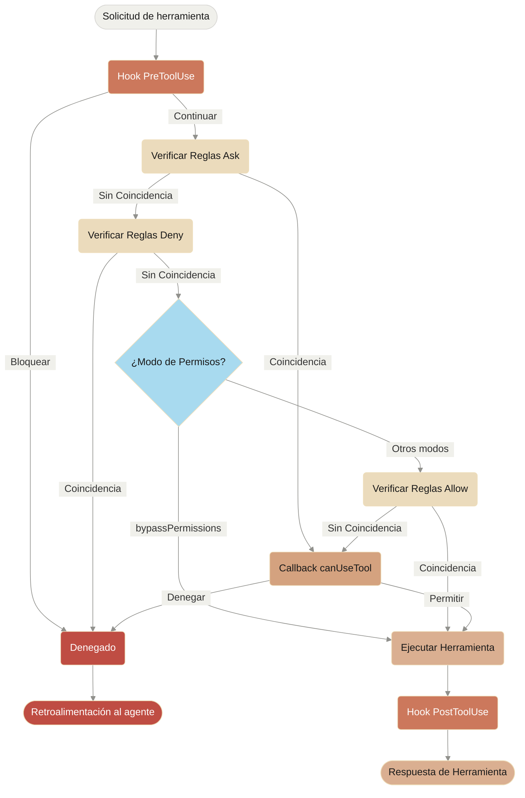

# Manejo de Permisos

> Controla el uso de herramientas y permisos en el SDK de Claude Code

<style>
  {`
    .edgeLabel {
      padding: 8px 12px !important;
    }
    .edgeLabel rect {
      rx: 4;
      ry: 4;
      stroke: #D9D8D5 !important;
      stroke-width: 1px !important;
    }
    /* Add rounded corners to flowchart nodes */
    .node rect {
      rx: 8 !important;
      ry: 8 !important;
    }
    `}
</style>

# Permisos del SDK

El SDK de Claude Code proporciona controles de permisos poderosos que te permiten gestionar cómo Claude usa las herramientas en tu aplicación.

Esta guía cubre cómo implementar sistemas de permisos usando el callback `canUseTool`, hooks y reglas de permisos de settings.json. Para la documentación completa de la API, consulta la [referencia del SDK de TypeScript](/es/docs/claude-code/typescript-sdk-reference).

## Descripción General

El SDK de Claude Code proporciona cuatro formas complementarias de controlar el uso de herramientas:

1. **[Modos de Permisos](#modos-de-permisos)** - Configuraciones globales de comportamiento de permisos que afectan todas las herramientas
2. **[callback canUseTool](/es/docs/claude-code/typescript-sdk-reference#canusetool)** - Manejador de permisos en tiempo de ejecución para casos no cubiertos por otras reglas
3. **[Hooks](/es/docs/claude-code/typescript-sdk-reference#hook-types)** - Control granular sobre cada ejecución de herramienta con lógica personalizada
4. **[Reglas de permisos (settings.json)](/es/docs/claude-code/settings#permission-settings)** - Reglas declarativas de permitir/denegar con análisis integrado de comandos bash

Casos de uso para cada enfoque:

* Modos de permisos - Establecer comportamiento general de permisos (planificación, auto-aceptar ediciones, omitir verificaciones)
* `canUseTool` - Aprobación dinámica para casos no cubiertos, solicita permiso al usuario
* Hooks - Control programático sobre todas las ejecuciones de herramientas
* Reglas de permisos - Políticas estáticas con análisis inteligente de comandos bash

## Diagrama de Flujo de Permisos



**Orden de Procesamiento:** Hook PreToolUse → Reglas Ask → Reglas Deny → Verificación de Modo de Permisos → Reglas Allow → Callback canUseTool → Hook PostToolUse

## Modos de Permisos

Los modos de permisos proporcionan control global sobre cómo Claude usa las herramientas. Puedes establecer el modo de permisos al llamar `query()` o cambiarlo dinámicamente durante sesiones de streaming.

### Modos Disponibles

El SDK soporta cuatro modos de permisos, cada uno con diferente comportamiento:

| Modo                | Descripción                                 | Comportamiento de Herramientas                                                                                                       |
| :------------------ | :------------------------------------------ | :----------------------------------------------------------------------------------------------------------------------------------- |
| `default`           | Comportamiento estándar de permisos         | Se aplican verificaciones normales de permisos                                                                                       |
| `plan`              | Modo de planificación - sin ejecución       | Claude solo puede usar herramientas de solo lectura; presenta un plan antes de la ejecución **(Actualmente no soportado en el SDK)** |
| `acceptEdits`       | Auto-aceptar ediciones de archivos          | Las ediciones de archivos y operaciones del sistema de archivos son automáticamente aprobadas                                        |
| `bypassPermissions` | Omitir todas las verificaciones de permisos | Todas las herramientas se ejecutan sin solicitudes de permisos (usar con precaución)                                                 |

### Establecer Modo de Permisos

Puedes establecer el modo de permisos de dos formas:

#### 1. Configuración Inicial

Establece el modo al crear una consulta:

<CodeGroup>
  ```typescript TypeScript
  import { query } from "@anthropic-ai/claude-code";

  const result = await query({
    prompt: "Ayúdame a refactorizar este código",
    options: {
      permissionMode: 'default'  // Modo de permisos estándar
    }
  });
  ```

  ```python Python
  from claude_code_sdk import query

  result = await query(
      prompt="Ayúdame a refactorizar este código",
      options={
          "permission_mode": "default"  # Modo de permisos estándar
      }
  )
  ```
</CodeGroup>

#### 2. Cambios de Modo Dinámicos (Solo Streaming)

Cambia el modo durante una sesión de streaming:

<CodeGroup>
  ```typescript TypeScript
  import { query } from "@anthropic-ai/claude-code";

  // Crear un generador asíncrono para entrada de streaming
  async function* streamInput() {
    yield {
      type: 'user',
      message: {
        role: 'user',
        content: "Comencemos con permisos predeterminados"
      }
    };

    // Más tarde en la conversación...
    yield {
      type: 'user',
      message: {
        role: 'user',
        content: "Ahora aceleremos el desarrollo"
      }
    };
  }

  const q = query({
    prompt: streamInput(),
    options: {
      permissionMode: 'default'  // Comenzar en modo predeterminado
    }
  });

  // Cambiar modo dinámicamente
  await q.setPermissionMode('acceptEdits');

  // Procesar mensajes
  for await (const message of q) {
    console.log(message);
  }
  ```

  ```python Python
  from claude_code_sdk import query

  async def stream_input():
      """Generador asíncrono para entrada de streaming"""
      yield {
          "type": "user",
          "message": {
              "role": "user",
              "content": "Comencemos con permisos predeterminados"
          }
      }

      # Más tarde en la conversación...
      yield {
          "type": "user",
          "message": {
              "role": "user",
              "content": "Ahora aceleremos el desarrollo"
          }
      }

  q = query(
      prompt=stream_input(),
      options={
          "permission_mode": "default"  # Comenzar en modo predeterminado
      }
  )

  # Cambiar modo dinámicamente
  await q.set_permission_mode("acceptEdits")

  # Procesar mensajes
  async for message in q:
      print(message)
  ```
</CodeGroup>

### Comportamientos Específicos del Modo

#### Modo Aceptar Ediciones (`acceptEdits`)

En modo aceptar ediciones:

* Todas las ediciones de archivos son automáticamente aprobadas
* Las operaciones del sistema de archivos (mkdir, touch, rm, etc.) son auto-aprobadas
* Otras herramientas aún requieren permisos normales
* Acelera el desarrollo cuando confías en las ediciones de Claude
* Útil para prototipado rápido e iteraciones

Operaciones auto-aprobadas:

* Ediciones de archivos (herramientas Edit, MultiEdit, Write)
* Comandos bash del sistema de archivos (mkdir, touch, rm, mv, cp)
* Creación y eliminación de archivos

#### Modo Omitir Permisos (`bypassPermissions`)

En modo omitir permisos:

* **TODOS los usos de herramientas son automáticamente aprobados**
* No aparecen solicitudes de permisos
* Los hooks aún se ejecutan (pueden seguir bloqueando operaciones)
* **Usar con extrema precaución** - Claude tiene acceso completo al sistema
* Recomendado solo para entornos controlados

### Prioridad del Modo en el Flujo de Permisos

Los modos de permisos se evalúan en un punto específico del flujo de permisos:

1. **Los hooks se ejecutan primero** - Pueden anular cualquier modo
2. **Se verifican las reglas de denegación** - Bloquean herramientas independientemente del modo
3. **Modo `bypassPermissions`** - Si está activo, permite todas las herramientas restantes
4. **Se verifican las reglas de permitir**
5. **Otros modos** afectan comportamientos específicos de herramientas
6. **Callback `canUseTool`** - Maneja casos restantes

Esto significa:

* Los hooks siempre pueden bloquear el uso de herramientas, incluso en modo `bypassPermissions`
* Las reglas explícitas de denegación anulan todos los modos de permisos
* El modo `bypassPermissions` anula las reglas de permitir y `canUseTool`

### Mejores Prácticas

1. **Usar modo predeterminado** para ejecución controlada con verificaciones normales de permisos
2. **Usar modo acceptEdits** cuando trabajas en archivos o directorios aislados
3. **Evitar bypassPermissions** en producción o en sistemas con datos sensibles
4. **Combinar modos con hooks** para control granular
5. **Cambiar modos dinámicamente** basado en el progreso de la tarea y la confianza

Ejemplo de progresión de modos:

```typescript
// Comenzar en modo predeterminado para ejecución controlada
permissionMode: 'default'

// Cambiar a acceptEdits para iteración rápida
await q.setPermissionMode('acceptEdits')
```

## canUseTool

El callback `canUseTool` se pasa como una opción al llamar la función `query`. Recibe el nombre de la herramienta y los parámetros de entrada, y debe devolver una decisión - ya sea permitir o denegar.

canUseTool se activa cuando Claude Code mostraría una solicitud de permisos a un usuario, por ejemplo, los hooks y reglas de permisos no lo cubren y no está en modo de auto-aceptación.

Aquí hay un ejemplo completo que muestra cómo implementar aprobación interactiva de herramientas:

<CodeGroup>
  ```typescript TypeScript
  import { query } from "@anthropic-ai/claude-code";

  async function promptForToolApproval(toolName: string, input: any) {
    console.log("\n🔧 Solicitud de Herramienta:");
    console.log(`   Herramienta: ${toolName}`);

    // Mostrar parámetros de herramienta
    if (input && Object.keys(input).length > 0) {
      console.log("   Parámetros:");
      for (const [key, value] of Object.entries(input)) {
        let displayValue = value;
        if (typeof value === 'string' && value.length > 100) {
          displayValue = value.substring(0, 100) + "...";
        } else if (typeof value === 'object') {
          displayValue = JSON.stringify(value, null, 2);
        }
        console.log(`     ${key}: ${displayValue}`);
      }
    }

    // Obtener aprobación del usuario (reemplazar con tu lógica de UI)
    const approved = await getUserApproval();

    if (approved) {
      console.log("   ✅ Aprobado\n");
      return {
        behavior: "allow",
        updatedInput: input
      };
    } else {
      console.log("   ❌ Denegado\n");
      return {
        behavior: "deny",
        message: "El usuario denegó el permiso para esta herramienta"
      };
    }
  }

  // Usar el callback de permisos
  const result = await query({
    prompt: "Ayúdame a analizar esta base de código",
    options: {
      canUseTool: async (toolName, input) => {
        return promptForToolApproval(toolName, input);
      }
    }
  });
  ```

  ```python Python
  from claude_code_sdk import query

  async def prompt_for_tool_approval(tool_name: str, input_params: dict):
      print(f"\n🔧 Solicitud de Herramienta:")
      print(f"   Herramienta: {tool_name}")

      # Mostrar parámetros
      if input_params:
          print("   Parámetros:")
          for key, value in input_params.items():
              display_value = value
              if isinstance(value, str) and len(value) > 100:
                  display_value = value[:100] + "..."
              elif isinstance(value, (dict, list)):
                  display_value = json.dumps(value, indent=2)
              print(f"     {key}: {display_value}")

      # Obtener aprobación del usuario
      answer = input("\n   ¿Aprobar este uso de herramienta? (s/n): ")

      if answer.lower() in ['s', 'sí', 'si']:
          print("   ✅ Aprobado\n")
          return {
              "behavior": "allow",
              "updatedInput": input_params
          }
      else:
          print("   ❌ Denegado\n")
          return {
              "behavior": "deny",
              "message": "El usuario denegó el permiso para esta herramienta"
          }

  # Usar el callback de permisos
  result = await query(
      prompt="Ayúdame a analizar esta base de código",
      options={
          "can_use_tool": prompt_for_tool_approval
      }
  )
  ```
</CodeGroup>

## Usar Hooks para Control de Herramientas

Los hooks proporcionan control programático sobre la ejecución de herramientas en varias etapas. Los hooks se llaman para cada uso de herramienta, dándote control completo sobre el pipeline de permisos.

### Implementación de Hooks

<CodeGroup>
  ```typescript TypeScript
  import { query } from "@anthropic-ai/claude-code";

  const result = await query({
    prompt: "Ayúdame a refactorizar este código",
    options: {
      hooks: {
        PreToolUse: [{
          hooks: [async (input, toolUseId, { signal }) => {
            console.log(`Solicitud de herramienta: ${input.tool_name}`);

            // Analizar y validar entrada de herramienta tú mismo
            if (input.tool_name === "Bash") {
              const command = input.tool_input.command;
              if (command.startsWith("rm -rf")) {
                return {
                  decision: "block",
                  reason: "Comando peligroso bloqueado"
                };
              }
            }

            return { continue: true };
          }]
        }],
        PostToolUse: [{
          hooks: [async (input, toolUseId, { signal }) => {
            console.log(`Herramienta completada: ${input.tool_name}`);
            // Registrar o auditar resultados de herramientas
            return { continue: true };
          }]
        }]
      }
    }
  });
  ```

  ```python Python
  from claude_code_sdk import query, ClaudeCodeOptions, HookMatcher, HookContext
  from typing import Any

  async def pre_tool_hook(
      input_data: dict[str, Any],
      tool_use_id: str | None,
      context: HookContext
  ) -> dict[str, Any]:
      print(f"Solicitud de herramienta: {input_data['tool_name']}")

      # Lógica de validación personalizada
      if input_data['tool_name'] == 'Bash':
          command = input_data['tool_input'].get('command', '')
          if command.startswith('rm -rf'):
              return {
                  'hookSpecificOutput': {
                      'hookEventName': 'PreToolUse',
                      'permissionDecision': 'deny',
                      'permissionDecisionReason': 'Comando peligroso bloqueado'
                  }
              }

      return {}

  async def post_tool_hook(
      input_data: dict[str, Any],
      tool_use_id: str | None,
      context: HookContext
  ) -> dict[str, Any]:
      print(f"Herramienta completada: {input_data['tool_name']}")
      # Registrar o auditar resultados de herramientas
      return {}

  options = ClaudeCodeOptions(
      hooks={
          'PreToolUse': [
              HookMatcher(matcher='Bash', hooks=[pre_tool_hook])
          ],
          'PostToolUse': [
              HookMatcher(hooks=[post_tool_hook])
          ]
      }
  )

  result = await query(
      prompt="Ayúdame a refactorizar este código",
      options=options
  )
  ```
</CodeGroup>

### Diferencias Clave de canUseTool

* **Alcance**: Los hooks se llaman para todos los usos de herramientas; `canUseTool` maneja casos no cubiertos por reglas de permisos
* **Control**: Los hooks requieren analizar y validar entradas tú mismo
* **Eventos**: Los hooks soportan múltiples eventos (PreToolUse, PostToolUse, etc.) para diferentes etapas

## Usar Reglas de Permisos (settings.json)

Las reglas de permisos en `settings.json` proporcionan control declarativo con análisis integrado de comandos bash. Estas reglas se evalúan antes de que se llame `canUseTool`. Para más detalles sobre configuración de settings, consulta la [documentación de configuración de Claude Code](/es/docs/claude-code/settings).

### Estructura de Configuración

```json
{
  "permissions": {
    "allow": [
      "Bash(npm run lint)",
      "Bash(npm run test:*)",
      "Read(~/.zshrc)"
    ],
    "deny": [
      "Bash(curl:*)",
      "Read(./.env)",
      "Read(./secrets/**)",
      "WebFetch"
    ],
    "ask": [
      "Bash(git push:*)",
      "Write(./production/**)"
    ]
  }
}
```

### Sintaxis de Reglas

Las reglas de permisos siguen el patrón: `NombreHerramienta(patrón)`

* **Reglas Bash**: Usan coincidencia de prefijo (no regex). Ejemplo: `Bash(npm:*)` coincide con cualquier comando que comience con "npm"
* **Reglas de archivos**: Soportan patrones glob. Ejemplo: `Read(./src/**/*.ts)` coincide con archivos TypeScript en src
* **Reglas solo de herramienta**: Omite paréntesis para controlar herramientas completas. Ejemplo: `WebFetch` bloquea todas las búsquedas web

### Usar con SDK

Aunque las reglas aún no se pueden establecer programáticamente en el SDK, se leerán del archivo settings.json en la ruta donde se carga el SDK.

### Orden de Evaluación de Permisos

1. **Las reglas de denegación** se verifican primero - si coinciden, el uso de herramienta se bloquea
2. **Las reglas de permitir** se verifican después - si coinciden, el uso de herramienta se permite
3. **Las reglas de preguntar** se verifican - si coinciden, se solicita al usuario
4. **El callback canUseTool** se invoca para cualquier caso restante

### Análisis de Comandos Bash

El SDK incluye un analizador bash integrado que entiende la estructura de comandos:

* Maneja pipes, redirecciones y sustitución de comandos
* Reconoce patrones peligrosos como `rm -rf` o `curl | sh`
* Soporta comodines y coincidencia de prefijos

Ejemplo de cómo funcionan los patrones bash:

* `Bash(git:*)` - Coincide con cualquier comando git
* `Bash(npm run test)` - Coincide con comando exacto
* `Bash(npm run test:*)` - Coincide con npm run test:unit, test:integration, etc.

## Mejores Prácticas

1. **Comenzar con modo predeterminado** para verificaciones estándar de permisos
2. **Usar reglas de permisos** para políticas estáticas, especialmente comandos bash (ver [configuración de permisos](/es/docs/claude-code/settings#permission-settings))
3. **Usar hooks** para registrar, auditar o transformar todos los usos de herramientas (ver [tipos de hooks](/es/docs/claude-code/typescript-sdk-reference#hook-types))
4. **Usar canUseTool** para decisiones dinámicas en casos no cubiertos (ver [tipo CanUseTool](/es/docs/claude-code/typescript-sdk-reference#canusetool))
5. **Capas de defensas** combinando modos, reglas, hooks y callbacks para aplicaciones críticas
