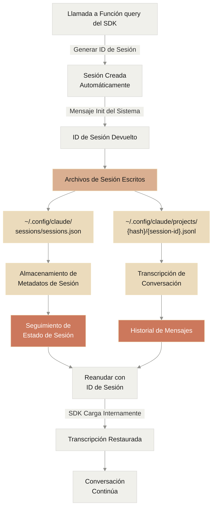

# Gestión de Sesiones

> Comprender cómo el Claude Code SDK maneja las sesiones, archivos de sesión y reanudación de sesiones

<style>
  {`
    .edgeLabel {
      padding: 8px 12px !important;
    }
    .edgeLabel rect {
      rx: 4;
      ry: 4;
      stroke: #D9D8D5 !important;
      stroke-width: 1px !important;
    }
    /* Add rounded corners to flowchart nodes */
    .node rect {
      rx: 8 !important;
      ry: 8 !important;
    }
    `}
</style>

# Gestión de Sesiones

El Claude Code SDK proporciona capacidades de gestión de sesiones para manejar el estado de conversación, persistencia y reanudación. Esta guía cubre cómo se crean, gestionan, persisten en archivos y reanudan las sesiones dentro del SDK.

## Arquitectura de Sesiones

El Claude Code SDK implementa un sistema de gestión de sesiones basado en archivos que maneja la persistencia de conversaciones y la restauración de estado.



## Estructura de Archivos de Sesión

Las sesiones se persisten en el sistema de archivos local en un formato estructurado:

```
~/.config/claude/
├── sessions/
│   └── sessions.json          # Metadatos y estado de sesión
└── projects/
    └── {project-hash}/
        └── {session-id}.jsonl # Transcripción de sesión
```

### Formato de Metadatos de Sesión

El archivo `sessions.json` almacena metadatos sobre todas las sesiones:

<CodeGroup>
  ```typescript TypeScript
  interface SessionMetadata {
    id: string
    name: string
    status: 'active' | 'completed' | 'interrupted'
    createdAt: Date
    updatedAt: Date
    completedAt?: Date
    projectPath: string
    transcriptPath: string
    metadata: {
      model?: string
      tools?: string[]
      lastMessageId?: string
    }
  }
  ```

  ```python Python
  from typing import Optional, List
  from datetime import datetime

  class SessionMetadata:
      def __init__(self):
          self.id: str
          self.name: str
          self.status: str  # 'active', 'completed', 'interrupted'
          self.created_at: datetime
          self.updated_at: datetime
          self.completed_at: Optional[datetime] = None
          self.project_path: str
          self.transcript_path: str
          self.metadata: dict = {
              "model": None,
              "tools": [],
              "last_message_id": None
          }
  ```
</CodeGroup>

### Formato de Transcripción de Sesión

Las transcripciones de sesión se almacenan como archivos JSONL (JSON Lines), con cada línea representando un mensaje o evento:

```json
{"type":"user","uuid":"abc123","timestamp":"2024-01-01T10:00:00Z","message":{"content":"Hola Claude"}}
{"type":"assistant","uuid":"def456","parentUuid":"abc123","timestamp":"2024-01-01T10:00:01Z","message":{"content":[{"type":"text","text":"¡Hola! ¿Cómo puedo ayudar?"}]}}
{"type":"checkpoint","sessionId":"session123","commit":"a1b2c3d","timestamp":"2024-01-01T10:00:02Z","label":"Estado inicial","id":"chk456"}
```

Cada línea en el archivo JSONL representa:

* **Mensajes de usuario**: Entrada del usuario
* **Mensajes del asistente**: Respuestas de Claude
* **Puntos de control**: Estados guardados en la conversación (ej., después de completar una tarea)
* **Uso de herramientas**: Registros de cuándo se invocaron herramientas y sus resultados

## Ciclo de Vida de la Sesión

### Creación e Inicialización

Cuando una sesión comienza, el SDK realiza varios pasos de inicialización:

1. **Generar ID de Sesión**: Crea un identificador único para la sesión
2. **Crear Directorio de Proyecto**: Configura la ubicación de almacenamiento específica del proyecto
3. **Inicializar Archivo de Transcripción**: Crea un archivo JSONL vacío para la conversación
4. **Almacenar Metadatos Iniciales**: Registra el tiempo de creación de la sesión y configuración

### Obtener el ID de Sesión

El ID de sesión se proporciona en el mensaje inicial del sistema cuando inicias una conversación. Puedes capturarlo para uso posterior:

<CodeGroup>
  ```typescript TypeScript
  import { query } from "@anthropic-ai/claude-code"

  let sessionId: string | undefined

  const response = query({
    prompt: "Ayúdame a construir una aplicación web",
    options: {
      model: "claude-sonnet-4-20250514"
    }
  })

  for await (const message of response) {
    // El primer mensaje es un mensaje init del sistema con el ID de sesión
    if (message.type === 'system' && message.subtype === 'init') {
      sessionId = message.session_id
      console.log(`Sesión iniciada con ID: ${sessionId}`)
      // Puedes guardar este ID para reanudación posterior
    }

    // Procesar otros mensajes...
    console.log(message)
  }

  // Más tarde, puedes usar el sessionId guardado para reanudar
  if (sessionId) {
    const resumedResponse = query({
      prompt: "Continúa donde lo dejamos",
      options: {
        resume: sessionId
      }
    })
  }
  ```

  ```python Python
  from claude_code_sdk import query, ClaudeCodeOptions

  session_id = None

  async for message in query(
      prompt="Ayúdame a construir una aplicación web",
      options=ClaudeCodeOptions(
          model="claude-sonnet-4-20250514"
      )
  ):
      # El primer mensaje es un mensaje init del sistema con el ID de sesión
      if hasattr(message, 'subtype') and message.subtype == 'init':
          session_id = message.data.get('session_id')
          print(f"Sesión iniciada con ID: {session_id}")
          # Puedes guardar este ID para reanudación posterior

      # Procesar otros mensajes...
      print(message)

  # Más tarde, puedes usar el session_id guardado para reanudar
  if session_id:
      async for message in query(
          prompt="Continúa donde lo dejamos",
          options=ClaudeCodeOptions(
              resume=session_id
          )
      ):
          print(message)
  ```
</CodeGroup>

### Persistencia de Estado de Sesión

El SDK persiste automáticamente el estado de la sesión en disco:

* **Después de cada intercambio de mensajes**: La transcripción se actualiza
* **En invocaciones de herramientas**: Se registran el uso de herramientas y resultados
* **En puntos de control**: Se marcan estados importantes de la conversación
* **Al final de la sesión**: Se guarda el estado final

## Reanudación de Sesión

El SDK soporta reanudar sesiones desde estados de conversación previos, habilitando flujos de trabajo de desarrollo continuos.

### Reanudar desde Archivos de Sesión

<CodeGroup>
  ```typescript TypeScript
  import { query } from "@anthropic-ai/claude-code"

  // Reanudar una sesión previa usando su ID
  const response = query({
    prompt: "Continúa implementando el sistema de autenticación desde donde lo dejamos",
    options: {
      resume: "session-xyz", // ID de sesión de conversación previa
      model: "claude-sonnet-4-20250514",
      allowedTools: ["Read", "Edit", "Write", "Glob", "Grep", "Bash"]
    }
  })

  // La conversación continúa con contexto completo de la sesión previa
  for await (const message of response) {
    console.log(message)
  }
  ```

  ```python Python
  from claude_code_sdk import query, ClaudeCodeOptions

  # Reanudar una sesión previa usando su ID
  async for message in query(
      prompt="Continúa implementando el sistema de autenticación desde donde lo dejamos",
      options=ClaudeCodeOptions(
          resume="session-xyz",  # ID de sesión de conversación previa
          model="claude-sonnet-4-20250514",
          allowed_tools=["Read", "Edit", "Write", "Glob", "Grep", "Bash"]
      )
  ):
      print(message)

  # La conversación continúa con contexto completo de la sesión previa
  ```
</CodeGroup>

## Manejo de Errores y Recuperación

### Manejo de Sesiones Interrumpidas

<CodeGroup>
  ```typescript TypeScript
  import { query } from '@anthropic-ai/claude-code'
  import { readFile } from 'fs/promises'
  import { homedir } from 'os'
  import { join } from 'path'

  // Verificar si una sesión fue interrumpida
  const checkSessionStatus = async (sessionId: string) => {
    const metadataPath = join(homedir(), '.config/claude/sessions/sessions.json')
    const metadata = JSON.parse(await readFile(metadataPath, 'utf-8'))

    const session = metadata.find(s => s.id === sessionId)

    if (session?.status === 'interrupted') {
      console.log('La sesión fue interrumpida. Lista para reanudación...')

      // El SDK maneja la carga de la transcripción internamente
      return {
        canResume: true,
        sessionId: sessionId
      }
    }

    return { canResume: false }
  }

  // Reanudar una sesión interrumpida
  const resumeInterrupted = async (sessionId: string) => {
    const status = await checkSessionStatus(sessionId)

    if (status.canResume) {
      const response = query({
        prompt: "Continuemos desde donde lo dejamos",
        options: {
          resume: status.sessionId
        }
      })

      for await (const message of response) {
        console.log(message)
      }
    }
  }
  ```

  ```python Python
  import json
  from pathlib import Path
  from claude_code_sdk import query, ClaudeCodeOptions

  # Verificar si una sesión fue interrumpida
  async def check_session_status(session_id: str):
      metadata_path = Path.home() / '.config/claude/sessions/sessions.json'

      with open(metadata_path, 'r') as f:
          metadata = json.load(f)

      session = next((s for s in metadata if s['id'] == session_id), None)

      if session and session.get('status') == 'interrupted':
          print('La sesión fue interrumpida. Lista para reanudación...')

          # El SDK maneja la carga de la transcripción internamente
          return {
              'can_resume': True,
              'session_id': session_id
          }

      return {'can_resume': False}

  # Reanudar una sesión interrumpida
  async def resume_interrupted(session_id: str):
      status = await check_session_status(session_id)

      if status['can_resume']:
          async for message in query(
              prompt="Continuemos desde donde lo dejamos",
              options=ClaudeCodeOptions(
                  resume=status['session_id']
              )
          ):
              print(message)
  ```
</CodeGroup>

El sistema de gestión de sesiones del Claude Code SDK proporciona una base robusta para mantener el estado de conversación y habilitar la reanudación sin problemas de tareas de desarrollo, todo a través de un enfoque simple basado en archivos que no requiere infraestructura externa.
