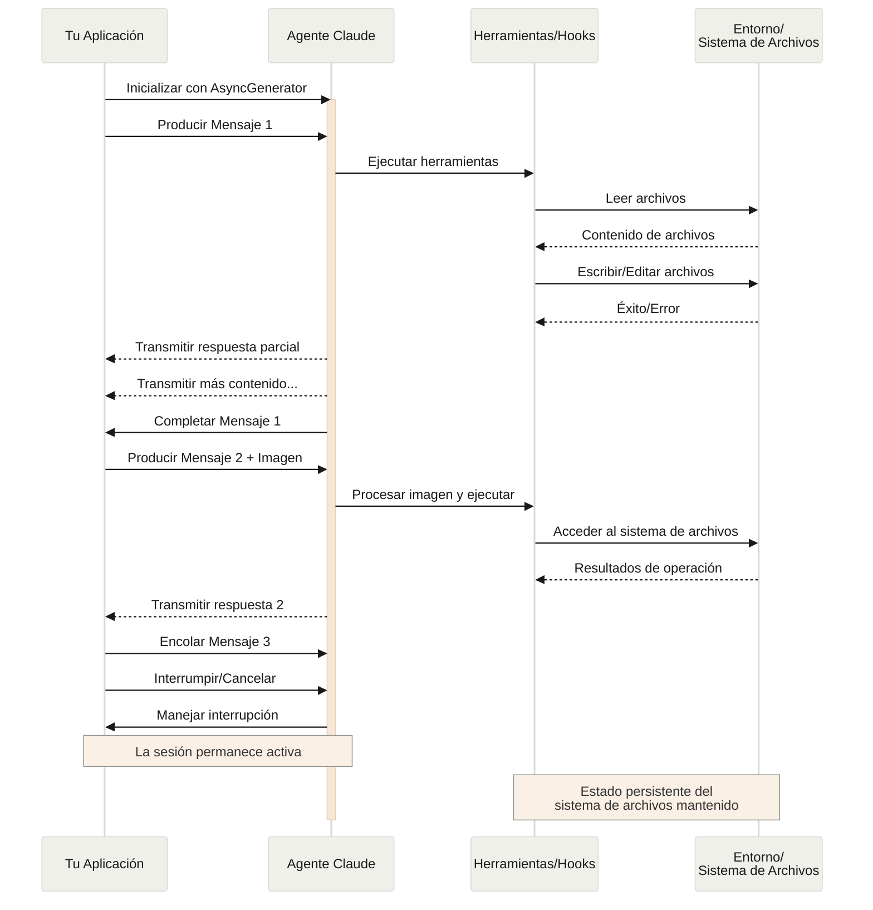

# Entrada de Streaming

> Comprender los dos modos de entrada para Claude Code SDK y cuándo usar cada uno

## Descripción General

El Claude Code SDK admite dos modos de entrada distintos para interactuar con agentes:

* **Modo de Entrada de Streaming** (Predeterminado y Recomendado) - Una sesión interactiva persistente
* **Entrada de Mensaje Único** - Consultas de una sola vez que usan el estado de sesión y la reanudación

Esta guía explica las diferencias, beneficios y casos de uso para cada modo para ayudarte a elegir el enfoque correcto para tu aplicación.

## Modo de Entrada de Streaming (Recomendado)

El modo de entrada de streaming es la forma **preferida** de usar el Claude Code SDK. Proporciona acceso completo a las capacidades del agente y permite experiencias ricas e interactivas.

Permite que el agente opere como un proceso de larga duración que recibe entrada del usuario, maneja interrupciones, presenta solicitudes de permisos y gestiona la administración de sesiones.

### Cómo Funciona



### Beneficios

<CardGroup cols={2}>
  <Card title="Subida de Imágenes" icon="image">
    Adjunta imágenes directamente a los mensajes para análisis visual y comprensión
  </Card>

  <Card title="Mensajes en Cola" icon="layer-group">
    Envía múltiples mensajes que se procesan secuencialmente, con capacidad de interrumpir
  </Card>

  <Card title="Integración de Herramientas" icon="wrench">
    Acceso completo a todas las herramientas y servidores MCP personalizados durante la sesión
  </Card>

  <Card title="Soporte de Hooks" icon="link">
    Usa hooks de ciclo de vida para personalizar el comportamiento en varios puntos
  </Card>

  <Card title="Retroalimentación en Tiempo Real" icon="bolt">
    Ve las respuestas mientras se generan, no solo los resultados finales
  </Card>

  <Card title="Persistencia de Contexto" icon="database">
    Mantén el contexto de conversación a través de múltiples turnos naturalmente
  </Card>
</CardGroup>

### Ejemplo de Implementación

<CodeGroup>
  ```typescript TypeScript
  import { query } from "@anthropic-ai/claude-code";
  import { readFileSync } from "fs";

  async function* generateMessages() {
    // Primer mensaje
    yield {
      type: "user" as const,
      message: {
        role: "user" as const,
        content: "Analiza esta base de código en busca de problemas de seguridad"
      }
    };

    // Esperar condiciones o entrada del usuario
    await new Promise(resolve => setTimeout(resolve, 2000));

    // Seguimiento con imagen
    yield {
      type: "user" as const,
      message: {
        role: "user" as const,
        content: [
          {
            type: "text",
            text: "Revisa este diagrama de arquitectura"
          },
          {
            type: "image",
            source: {
              type: "base64",
              media_type: "image/png",
              data: readFileSync("diagram.png", "base64")
            }
          }
        ]
      }
    };
  }

  // Procesar respuestas de streaming
  for await (const message of query({
    prompt: generateMessages(),
    options: {
      maxTurns: 10,
      allowedTools: ["Read", "Grep"]
    }
  })) {
    if (message.type === "result") {
      console.log(message.result);
    }
  }
  ```

  ```python Python
  from claude_code_sdk import ClaudeSDKClient, ClaudeCodeOptions, AssistantMessage, TextBlock
  import asyncio
  import base64

  async def streaming_analysis():
      async def message_generator():
          # Primer mensaje
          yield {
              "type": "user",
              "message": {
                  "role": "user",
                  "content": "Analiza esta base de código en busca de problemas de seguridad"
              }
          }

          # Esperar condiciones
          await asyncio.sleep(2)

          # Seguimiento con imagen
          with open("diagram.png", "rb") as f:
              image_data = base64.b64encode(f.read()).decode()

          yield {
              "type": "user",
              "message": {
                  "role": "user",
                  "content": [
                      {
                          "type": "text",
                          "text": "Revisa este diagrama de arquitectura"
                      },
                      {
                          "type": "image",
                          "source": {
                              "type": "base64",
                              "media_type": "image/png",
                              "data": image_data
                          }
                      }
                  ]
              }
          }

      # Usar ClaudeSDKClient para entrada de streaming
      options = ClaudeCodeOptions(
          max_turns=10,
          allowed_tools=["Read", "Grep"]
      )

      async with ClaudeSDKClient(options) as client:
          # Enviar entrada de streaming
          await client.query(message_generator())

          # Procesar respuestas
          async for message in client.receive_response():
              if isinstance(message, AssistantMessage):
                  for block in message.content:
                      if isinstance(block, TextBlock):
                          print(block.text)

  asyncio.run(streaming_analysis())
  ```
</CodeGroup>

## Entrada de Mensaje Único

La entrada de mensaje único es más simple pero más limitada.

### Cuándo Usar Entrada de Mensaje Único

Usa entrada de mensaje único cuando:

* Necesites una respuesta de una sola vez
* No necesites adjuntos de imagen, hooks, etc.
* Necesites operar en un entorno sin estado, como una función lambda

### Limitaciones

<Warning>
  El modo de entrada de mensaje único **no** admite:

  * Adjuntos de imagen directos en mensajes
  * Encolado dinámico de mensajes
  * Interrupción en tiempo real
  * Integración de hooks
  * Conversaciones naturales de múltiples turnos
</Warning>

### Ejemplo de Implementación

<CodeGroup>
  ```typescript TypeScript
  import { query } from "@anthropic-ai/claude-code";

  // Consulta simple de una sola vez
  for await (const message of query({
    prompt: "Explica el flujo de autenticación",
    options: {
      maxTurns: 1,
      allowedTools: ["Read", "Grep"]
    }
  })) {
    if (message.type === "result") {
      console.log(message.result);
    }
  }

  // Continuar conversación con gestión de sesión
  for await (const message of query({
    prompt: "Ahora explica el proceso de autorización",
    options: {
      continue: true,
      maxTurns: 1
    }
  })) {
    if (message.type === "result") {
      console.log(message.result);
    }
  }
  ```

  ```python Python
  from claude_code_sdk import query, ClaudeCodeOptions, ResultMessage
  import asyncio

  async def single_message_example():
      # Consulta simple de una sola vez usando la función query()
      async for message in query(
          prompt="Explica el flujo de autenticación",
          options=ClaudeCodeOptions(
              max_turns=1,
              allowed_tools=["Read", "Grep"]
          )
      ):
          if isinstance(message, ResultMessage):
              print(message.result)

      # Continuar conversación con gestión de sesión
      async for message in query(
          prompt="Ahora explica el proceso de autorización",
          options=ClaudeCodeOptions(
              continue_conversation=True,
              max_turns=1
          )
      ):
          if isinstance(message, ResultMessage):
              print(message.result)

  asyncio.run(single_message_example())
  ```
</CodeGroup>
